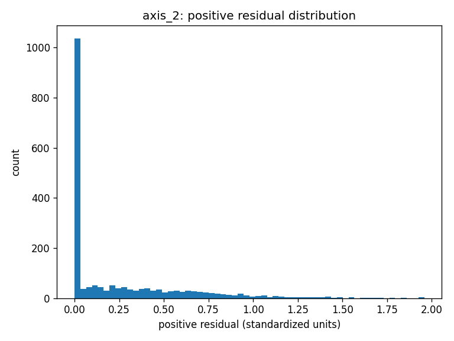

# Practical Lab 1 — Streaming Predictive Maintenance with Linear Regression Alerts

## Project Summary
This project extends a streaming industrial current pipeline by adding **univariate linear regression models**
(Time → Axis currents #1–#8) and a **residual-based anomaly detection** system to generate **Alerts** and **Errors**
for predictive maintenance.

Training data is pulled from a **cloud PostgreSQL database (Neon.tech)**. Synthetic test data is generated using
training metadata (time step, mean, std), then normalized/standardized with respect to the training distribution.

## Tech Stack
- Python (pandas, numpy, matplotlib)
- PostgreSQL (Neon.tech)
- Regression + residual analysis
- Threshold-based alerting with persistence (continuous time)

---

## Setup Instructions

### 1) Create a virtual environment and install requirements
```bash
python -m venv venv
# Windows:
venv\Scripts\activate
pip install -r requirements.txt
```

### 2) Configure Neon database credentials
DB_HOST=ep-wandering-wind-aieevr4n-pooler.c-4.us-east-1.aws.neon.tech
DB_PORT=5432
DB_NAME=neondb
DB_USER=neondb_owner
DB_PASSWORD=PASTE_YOUR_NEW_ROTATED_PASSWORD_HERE
DB_SSLMODE=require

RAW_TABLE=robot_currents_raw
EVENTS_TABLE=pm_events


### 3) Run the pipeline
```bash
# Option A (recommended): run the package
python -m src

# Option B: run the module directly
python -m src.run_pipeline
```

Outputs:
- `outputs/models/linreg_models.json`
- `outputs/models/scalers.json`
- `outputs/logs/events.csv`
- figures in `outputs/figures/` (generated from notebook)

### 4) (Optional) Generate 2 additional robot training datasets
This repo includes a helper to create two more robot datasets from the provided RMBR4-2 export:
- `data/training/RMBR4-1_export_artificial.csv`
- `data/training/RMBR4-3_export_artificial.csv`

It removes extreme **pick-point spikes** (robust clipping + light smoothing), then applies small robot-specific
scale/offset/noise differences.

Run:
```bash
python -m src.generate_additional_robots
```

This also ensures your `data/` folder has **three** subfolders:
- `data/training/`
- `data/synthetic_test/`
- `data/processed/` (normalized/standardized copies + combined training)


---

## Regression + Residual Logic

### Regression Model (per axis)
For each axis (1–8), a univariate linear regression is fit:
**Axis(t) = intercept + slope * time**

### Residuals
Residuals are computed as:
**residual = observed - predicted**

Only **positive residuals** are used for alerts/errors (above regression line).

---

## Threshold Discovery (MinC, MaxC, T)
Thresholds are not fixed. They are derived from training residuals.
A strong approach is to set:
- **MinC** = ~95th percentile of **positive residuals**
- **MaxC** = ~99th percentile of **positive residuals**
- **T** = persistence window (seconds) selected by testing multiple values until false positives decrease
  while sustained deviations remain detectable.

Evidence is shown in `notebooks/01_regression_threshold_discovery_FULL.ipynb`:
- regression plots per axis
- residual distribution plots
- quantile tables and event counts for multiple T values

The discovered thresholds are saved here (and used by the pipeline):
- `outputs/models/thresholds.json`  
  Current values in this repo: **MinC=0.706**, **MaxC=1.311**, **T=10s**

---

## Example Results (plots)
Regression line overlays and residual distributions are generated by the notebook and saved in `outputs/figures/`.

Example regression plot:


Example residual histogram:



---

## Alert & Error Rules
- **ALERT**: deviation ≥ MinC above regression line for ≥ T seconds continuously
- **ERROR**: deviation ≥ MaxC above regression line for ≥ T seconds continuously

Detected events are:
- logged to `outputs/logs/events.csv`
- stored in Neon table `pm_events`

---

## Repository Contents
- `src/` : database, preprocessing, regression, detection, streaming simulation
- `notebooks/` : threshold discovery and justification
- `data/` : synthetic test csv + (optional) training exports
- `outputs/` : models, logs, figures

---

## Notes
- If your database schema uses different column names than `time_s` and `axis_1..axis_8`, update `src/config.py`.
- For full rubric points, configure Neon in `.env` and ensure the training data is in `RAW_TABLE`.
  - The pipeline will automatically seed `RAW_TABLE` from `data/training/RMBR4-2_export_test.csv` when DB is configured.
